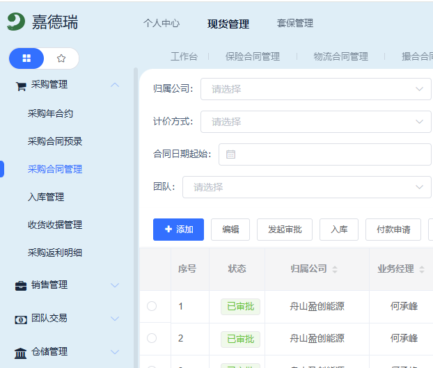
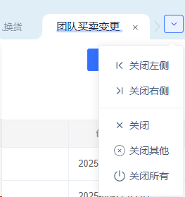
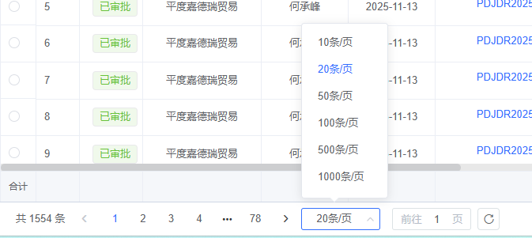
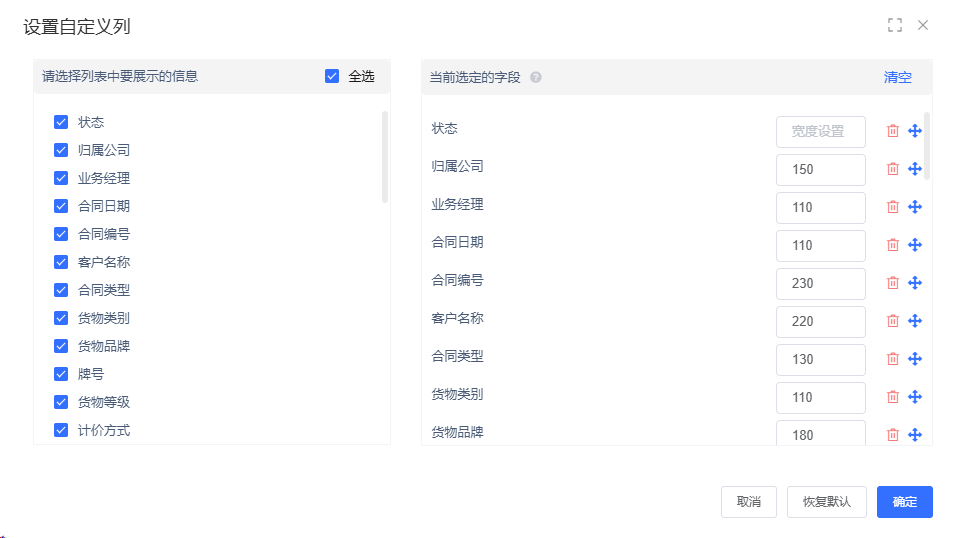
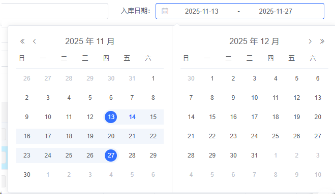
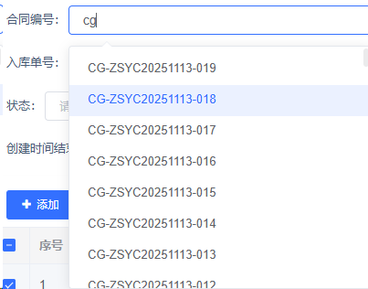
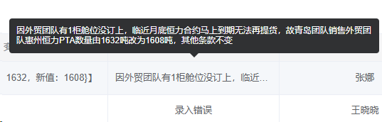
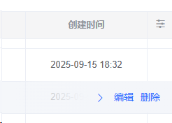

**参照嘉德瑞ERP的界面方案**

## 已定型界面方案（基于 prototype.html）

### 菜单布局描述
    
    系统菜单和打开的菜单页面留存
    
    **顶部Header区域（高度60px）**
        - 左侧：Logo徽章（40x40px，显示"快期"）+ 系统标题
            - 主标题：期现业务管理平台（16px，最大宽度250px）
            - 副标题：Prototype（10px，最大宽度250px）
        - 中间：页面顶端横列菜单（在Header内部，显示在标题右侧）
            合同宝
            指令宝
            匹配宝
            交易宝
            其他报表
            全局设置
        - 右侧：用户头像
        
    **页面左侧纵列菜单（宽度240px，可折叠）**
        定义为对顶端横列菜单的二级菜单目录
        纵列菜单可折叠为图标，节约空间，按hedge_user存档
        支持子菜单（三级菜单）
        
        合同宝
            合同管理（父菜单）
                采购合同管理（子菜单）
                销售合同管理（子菜单）
            报表
                均价合同今日净值预估
                查看合同与期货的关系
                查看采销合同的关系
                合同事件流水查询
                合同敞口分列与合计
        匹配宝
            期货委托与备注
        指令宝
            指令设置
            各岗位的指令工作台
            报表
        交易宝
            交易端
            历史委托
            历史成交
            指令查询
        风控宝
        其他报表
            期货账户信息一览，期末表
            保值方案信息一览，期末表
            合同套期关系一览表，期末表
            （瑞格）按业务负责人的合同的应交收和实际交收、标红提示期货套保但是未交收的合同，历史完整表
            （瑞格）按交易员认领的指令的完成情况和敞口，逐日表
            （瑞格）按交易员的投机交易记录和盈亏报表，历史完整表
        全局设置
            期货账户与保值方案
            现货品种与价格
            人员与角色
            客商管理
            指令预设
            合同自定字段
            期货自定字段
        右上用户名
            修改自己密码
内容布局描述
    点击二级菜单目录
        展开一个tab
        如果依次点开多个则横向排列
        每个展开tab固定在依次位置
        用户可以拖拽tab重排依次位置
        关闭tab后再次打开，tab应该在依次的末位
        每个tab只能打开一次，重复点价tab都会切换到已经打开的该tab页
        tab宽度根据字符宽度自适应
        页面tab状态需要在服务中按hedge_user存档，存档包含删选
        切换tab时会刷新内容
        暂时不支持tab双列对比显示
        支持tab按钮的批量关闭
            
    **Tab页签区域（高度42px）**
        位于左侧菜单和内容区域之间
        支持多Tab并行打开
        每个Tab可关闭（除Dashboard外）
        切换Tab时刷新内容
        
    **内容区域布局**
        内容区域内边距：上8px，左右9px，下12px
        
        **树+表格布局（适用于现货品种管理、客商管理等）**
            - 左侧树结构面板
                - 宽度：140px（已优化为原来的一半）
                - 内边距：8px
                - 高度：上下通栏（100%高度）
                - 树内容区域可滚动
            - 右侧表格面板
                - 布局顺序（从上到下）：
                    1. 筛选栏（复合筛选区域，背景色rgba(22, 119, 255, 0.03)）
                    2. 按钮工具栏（操作按钮：增加、编辑、删除等）
                    3. 表格（可滚动，支持横向滚动）
                - 内边距：8px
            - 树与表格间距：9px（已优化为原来的一半）
        
        **纯表格布局（适用于保值方案管理、期货账户管理、合同管理等）**
            - 布局顺序（从上到下）：
                1. 按钮工具栏（操作按钮）
                2. 表格（可滚动，支持横向滚动）
            - 面板内边距：8px
        
        **移动端工作台模式（屏幕宽度 ≤ 1024px 自动启用）**
            - 手机端不再展示树+表、复杂筛选，仅保留“我的工作台”页面
            - 页面结构：
                1. 个人信息卡片：头像、姓名、角色标签、提示“复杂操作请使用桌面端”
                2. 工作台入口卡片列表：依据角色动态生成，每个卡片包含标题/描述/来源角色/操作按钮
                3. 操作按钮：主按钮进入对应工作台（如指令、交易、报表、点价等），辅按钮跳转桌面端
                4. 详情抽屉：点击卡片操作可拉起底部 Drawer，解释当前工作台能力
            - 角色与工作台示例：
                - 交易员：指令工作台、Web 交易端
                - 业务经理：经营报表、客商点价
                - 制单员：指令工作台（制单任务）
                - 风控员：风险监控报表
            - 角色映射通过人员-角色关系表动态计算；无角色时提示联系管理员开通
            - 保留“前往桌面版”快速入口，引导用户在 PC 端处理复杂功能
        
    tab下的内容
        表格
            在表的上方有字段筛选和模糊搜索的复合筛选区域，如果字段要筛的太多，可以考虑收放按钮
            
            对表操作的按钮都做在筛选栏下方、表格上方，不会采用行尾的操作按钮
            表格都采用翻页控件，要考虑筛选时的视图推送
            翻页控件要求：
                默认每页 10 条，提供 10/20/50/100 四档可选页容量
                提供“前往第 ? 页”输入交互，输入目标页后点击“前往”按钮即可跳转
            
            表格列可以自定义是否显示、位置、列宽，宽度也可以在界面上拖拽，在服务中按hedge_user存档，存档包含排序列
            
            现货品种管理中的“是否主港 / 是否平台价”字段采用三态逻辑：
                - 取值：Invalid（继承）、是、否
                - 两个字段的“是/否”状态互斥：当其中一个设置为“是/否”时，另一个自动回到“Invalid”
                - 不允许两个字段同时为 Invalid；如果用户将某字段改为 Invalid，另一字段自动切换为“是”作为激活状态
                - 筛选器、表格列、编辑弹窗均需保持相同规则，默认值为“主港=是、平台价=Invalid”
            注意自定义字段的增删结果
            所有表格都有导出按钮，导入导出的字段一致，空表的导出可以作为excel模板
            
            列表均采用横向滚动条
            所有列都可以进行sort
            期货委托、合同、客商都有默认的备注列，支持单行编辑备注
            期货委托和合同都支持附件上传，支持单行编辑附件
        时间段选择器
            
        日期选择器
            
        下拉菜单选择器
            
        单元格内容显示不全的泡泡框
            
        单行快捷操作
            
        应该按照当前表格的业务id进行sort
        表格单元格点击行为
            单元格分为两种类型：
                不可操作类（默认）：点击单元格后，自动选中该行的radio或checkbox
                可操作类：点击单元格后，弹出详情对话框显示该行详细信息
            不可操作类单元格点击规则：
                点击单元格任意位置（除按钮、链接等交互元素外）都会选中该行
                鼠标悬停时显示pointer样式，提示可点击
                点击单元格内的按钮、链接、输入框、下拉框等交互元素时，不触发选中行为
            可操作类单元格设置：
                在列定义中设置 clickable: true 标识为可操作类
                可自定义 onCellClick 函数处理点击事件
                默认弹出详情对话框，显示该行数据的JSON格式
        表格单元格，如果需要信息扩展，可以做信息弹窗
        弹窗要尽量大，也可以在其中做tab切换
        tab内的层级
            
        表格按钮名称和定义
            增加：用于加一行数据
            删除：用于将一行数据在数据库中标志为delete
            修改：用于修改行数据内容
            禁用：禁止字段被引用，禁止人员登录系统
            启用：将禁用的人或字段再启用

## 已定型界面布局规范（基于 prototype.html 实现）

### 布局尺寸规范
- **Header高度**：60px
- **左侧菜单宽度**：240px（可折叠）
- **Tab页签高度**：42px
- **内容区域内边距**：上8px，左右9px，下12px
- **树结构面板宽度**：140px（已优化）
- **树与表格间距**：9px（已优化）
- **树面板内边距**：8px
- **表格面板内边距**：8px

### Header布局结构
- **左侧区域**：
  - Logo徽章：40x40px，圆角12px，渐变背景
  - 系统标题：主标题16px，副标题10px，最大宽度250px
- **中间区域**：顶部菜单（合同宝、指令宝等），在Header内部居中显示
- **右侧区域**：用户头像

### 内容区域布局规范
1. **树+表格布局**（现货品种管理、客商管理）：
   - 左侧树：140px宽，上下通栏，内容可滚动
   - 右侧表格区域布局顺序：
     - 筛选栏（顶部，背景色rgba(22, 119, 255, 0.03)）
     - 按钮工具栏（筛选下方）
     - 表格（按钮下方，可滚动）

2. **纯表格布局**（保值方案、期货账户、合同管理等）：
   - 按钮工具栏（顶部）
   - 表格（按钮下方，可滚动）

### 菜单结构规范
- 支持三级菜单（父菜单可展开子菜单）
- 子菜单使用中文key（如"采购合同管理"、"销售合同管理"）
- 菜单点击后自动创建Tab，Tab标签显示中文名称

### 样式规范
- 主色调：`#1677ff`
- 背景色：`rgba(244, 246, 251, 0.95)`
- 圆角：12px（面板），6px（按钮）
- 阴影：`0 12px 30px rgba(22, 119, 255, 0.05)`
- 字体：`"Segoe UI", "PingFang SC", "Microsoft YaHei"`