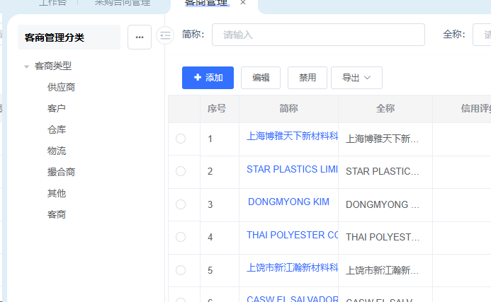

目录路径：
    一级：全局设置
    二级：客商管理
tab内容及UI
    左侧一个可以增删改的树状结构
        
        0级根目录名称：客商类型，操作的内容都是客商类型下的1级目录
        客商类型默认分类：供应商、客户、仓库、物流、撮合商、客商
        增和改都只能输入名称
    右侧一个表
        筛选
            简称：selectorbox & textbox
            全称：selectorbox & textbox
            联系人：selectorbox & textbox
            手机号：selectorbox & textbox
        按钮（导出按钮一定有，后续方案不再列出）
            增加
            编辑
            删除
            禁用/启用
        表格列
            单选radio_button
            简称
            全称
            联系人
            手机号
            状态
        增加编辑接口
            简称：str
            全称：str
            联系人：str
            手机号：str
        禁用删除启用接口
            客商_id：int
            status：enable/disable/delete
    项目删除编辑判断
        有合同在用的客商不能删除
    项目增加判断
        已有重复简称或者全称的客商，不能增加（简称唯一且全称唯一，分别唯一）